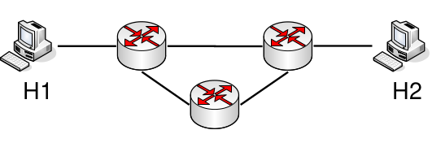
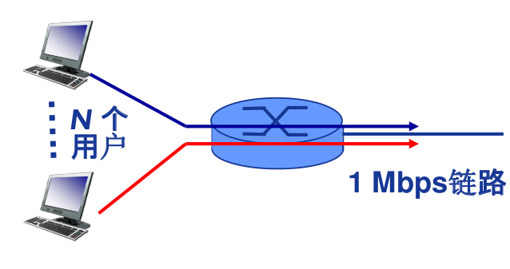

## 电路交换

1. 最典型的的电路交换网络：电话网络
2. 需要建立电路连接
   1. 建立连接（呼叫/电路建立）
   2. 通信
   3. 释放连接（拆除电路）
3. 独占资源（用户占用的电路不能共享）
4. 电路交换网络通过多路复用（Multiplexing）共享中继线

## 分组交换

### 计算公式

报文：$M$ bits

链路带宽（数据传输速率）：$R$ bps

分组长度（大小）：$L$ bits

跳步数：$h$ ($n-1$)

路由器数：$n$

传输时间：
$$
\begin{align*}
T &= M/R+(h-1)L/R \\
  &= M/R+nL/R
\end{align*}
$$

#### 例 1.1 （计算时间）

在下图所示的采用“存储-转发”方式的分组交换网络中，所有链路的数据传输速率为100 Mbps，分组大小为1 000 B，其中分组头大小为20 B。若主机H1向主机H2发送一个大小为980 000 B的文件，则在不考虑分组拆装时间和传播延迟的情况下，从H1发送开始到H2接收完为止，需要的时间至少是多少？

【解】980 000 B大小的文件需要分1000个分组，每个分组1 000 B。H1发送整个文件需要的传输延迟为 $(980 000+20*1000)*8/100 000 000=80ms$ 根据路由选择基本原理，所有数据分组应该经过两个路由的转发，所以再加上最后一个分组的两次转发的传输延迟，即 $2*1000*8/100 000 000=0.16ms$ 。所以，H2收完整个文件至少需 $80+0.16=80.16ms$ 。

## 分组交换 vs 电路交换

### 例题

共 1 Mb/s链路

每个用户：

- “活动”时需100 kb/s
- 平均活动时间10%

电路交换：

- 10 个用户

分组交换：

- 对于35个用户, 大于10个用户同时活动的概率<0.0004

分组交换允许更多用户同时使用网络——网络资源充分共享

### 分组交换绝对优于电路交换？

- 分组交换适用于突发数据传输网络
  - 资源充分共享
  - 简单、无需呼叫建立
- 分组交换可能产生拥塞（congestion）: 分组延迟和丢失
  - 需要协议处理可靠数据传输和拥塞控制
- Q: 如何提供电路级性能保障？
  - 例如，音/视频应用所需的带宽保障
